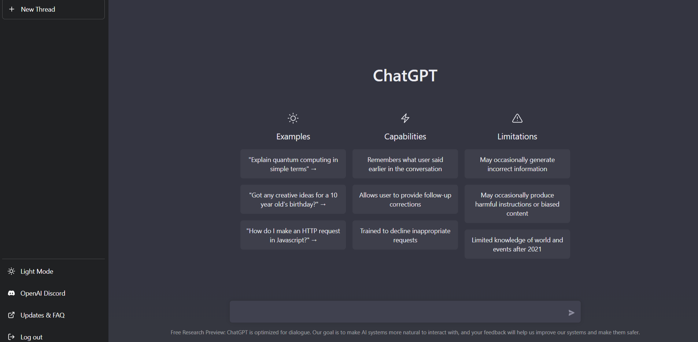
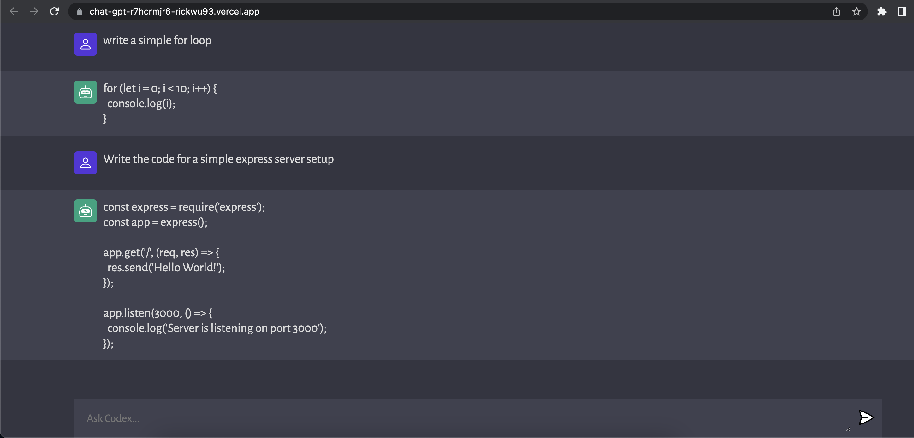

# ChatGPT AI App

This ChatAI App was built using Javascript, Rapid Api, Redux Toolkit, Openai and using express for the backened. 

## Vercel Frontend Deployment

Check out the app: https://chat-gpt-r7hcrmjr6-rickwu93.vercel.app/

## Render Backend Deployment

https://render.com/

## Project Screenshots

## Instructions To Start
1. Clone the repository 
2. Remove the Example.env file to add in your own openai key after registering: https://beta.openai.com/account/api-keys
3. CD into the server directory to npm run server (backend)
4. On another terminal tab, cd into client and npm run dev (frontend)
5. Test your bot on http://localhost:4000

### `Deployment`

## Backend Server
1. Register on https://render.com/ with GET STARTED FOR FREE and sign up using github. Click New and select web service. Then add in the public git repository URL below. Create a name, add "server" under the Root Directory and the start command will be "npm run server". Then choose free, and finally create web service.

2. Under the Environment tab, enter your openai Key/Value in.
Key: OPENAI_API_KEY Value:(openai key here)
Save Changes

3. Copy the backend URL and paste it under line 83 on script.js file to fetch from the backend server and push the build on github.

## Frontend Server
1. Register on https://vercel.com/ to start deploying, sign in on github and import in the repository from the list.
2. Give the project a name and edit the root directory to client
3. Continue and Deploy.
4. Git push the final build

## Credits
All credit of the project to JavaScript Mastery. https://www.youtube.com/@javascriptmastery 